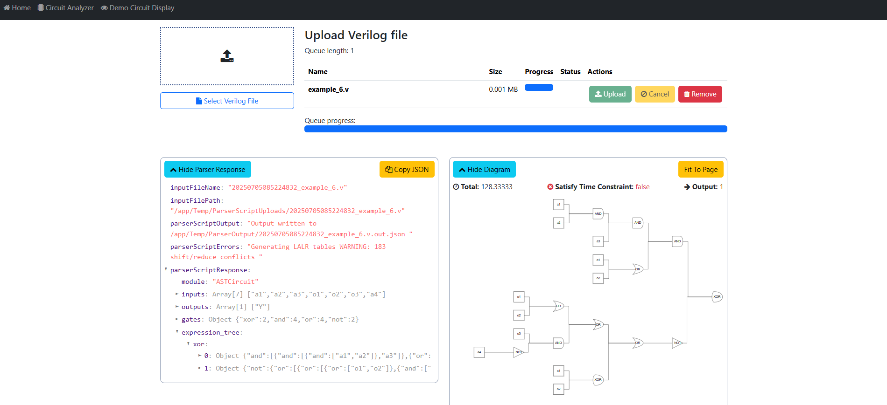
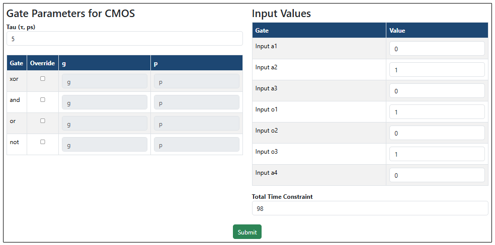
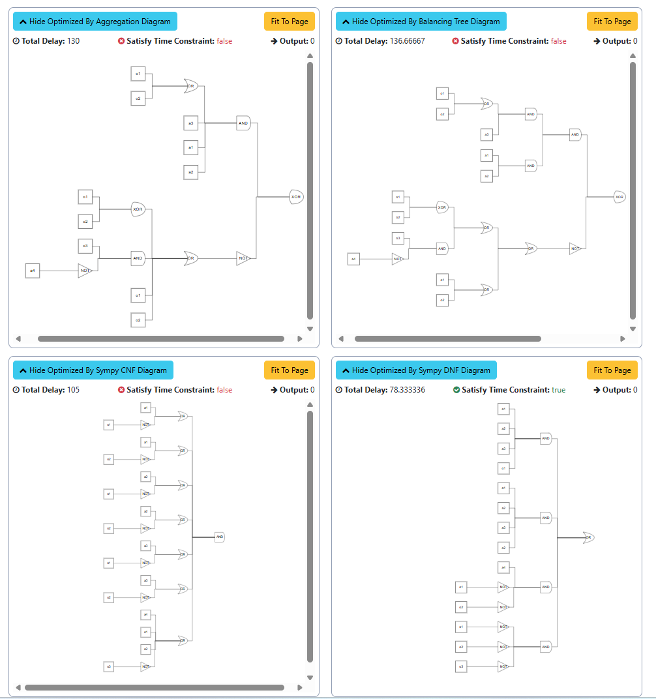
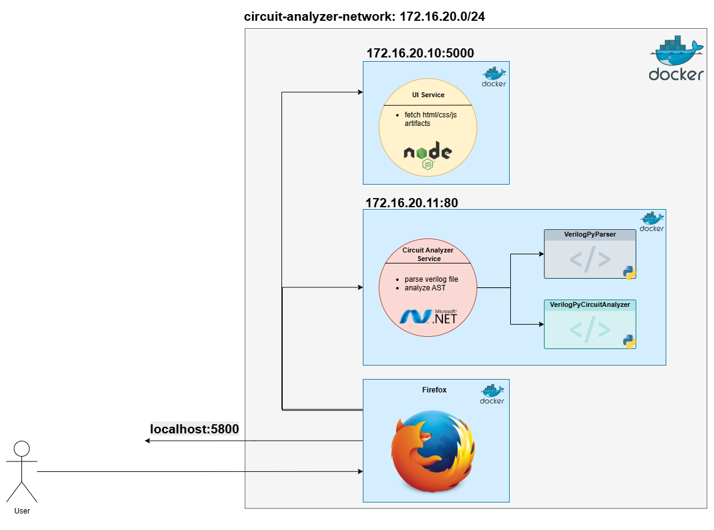
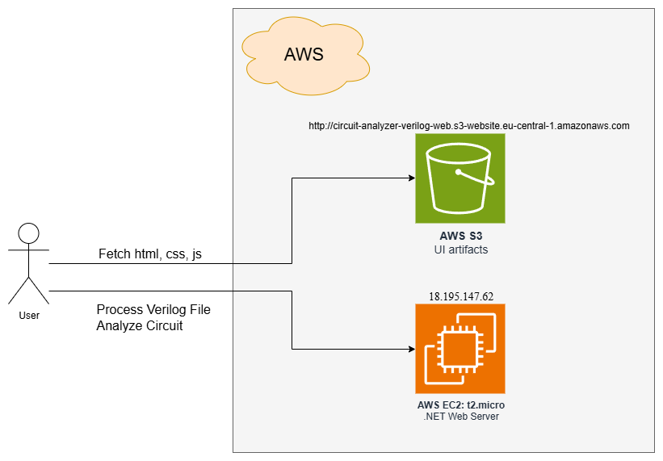
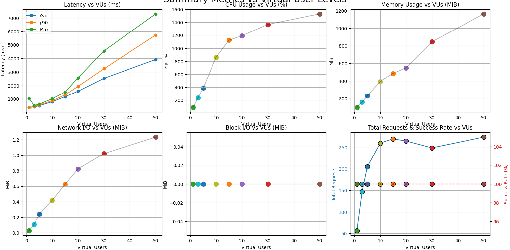
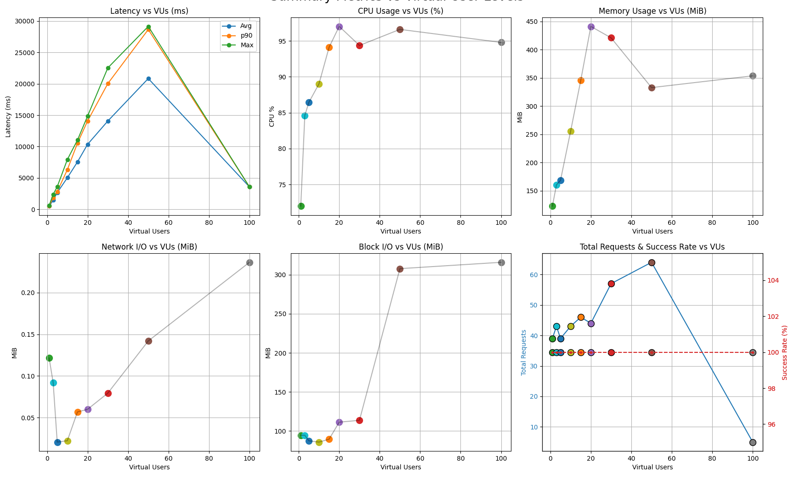

# Circuit Analyzer for Verilog

## Synthesis, Optimization and Delay Estimation for Pure Combinational Networks in CMOS Technology

A complete platform for analyzing, optimizing, and estimating delays in logic-combinational networks described in Verilog HDL. This project provides early-stage performance feedback without dependency on expensive commercial tools.

## 🎯 Overview

This platform automatically transforms Verilog code into an Abstract Syntax Tree (AST), applies structural optimizations, and estimates circuit delays using the Logical Effort model. The system features a containerized microservices architecture that's portable across local and cloud environments.

### Key Features

- **Verilog HDL Parsing**: Automatic conversion to AST representation
- **Structural Optimizations**:
  - Gate merging (fan-in aggregation)
  - Tree balancing for minimal depth
  - CNF/DNF canonical forms via SymPy
- **Delay Estimation**: Logical Effort model with parameterized gate delays
- **Web Interface**: Angular-based UI with real-time circuit visualization
- **Cloud Ready**: Docker containerization with AWS EC2/S3 deployment support

## 📸 Screenshots

### Circuit Upload and Parsing

*Upload Verilog files and view parsed AST structure with circuit visualization*

### Parameter Configuration

*Configure Logical Effort parameters (τ, g, p) and set time constraints*

### Optimization Results

*Compare four optimization strategies: Aggregation, Tree Balancing, CNF, and DNF forms*

## 🏗️ System Architecture

### Components

| Container | Technology | Responsibilities | Port |
|-----------|------------|-----------------|------|
| UI Service | Node.js + Angular | Serves static HTML/CSS/JS artifacts | 3000 |
| Circuit Analyzer API | ASP.NET 6 | REST API orchestration, Python script management | 3001 |
| VerilogPyParser | Python 3 & PyVerilog | Parses Verilog files, generates AST JSON | Internal |
| VerilogPyCircuitAnalyzer | Python 3 & SymPy | Applies optimizations, calculates delays | Internal |
| Firefox Container | jlesage/firefox | Optional browser for headless testing | 5800 |

## 🐳 Docker Architecture

The application uses a custom Docker bridge network (172.16.20.0/24) with the following container configuration:
- **UI Container**: 172.16.20.10 - Angular frontend
- **API Container**: 172.16.20.11 - .NET backend service
- **Firefox Container**: 172.16.20.20 - Optional testing environment

### Installation

For detailed Docker setup and build commands, see: [`Apps/Docker/docker_commands.bat`](Apps/Docker/docker_commands.bat)

The script includes:
- Network creation and configuration
- Container build instructions for UI and API
- Port mapping and IP assignments
- Optional Firefox container setup for testing

## ☁️ AWS Cloud Architecture

### AWS Services Used

- **EC2 Instance**: 
  - t2.micro for development/testing
  - t3.medium recommended for production
  - Hosts Docker containers for API processing
  
- **S3 Bucket**: 
  - Static website hosting for Angular UI artifacts
  - Public read access for frontend assets
  - URL: `http://circuit-analyzer-verilog-web.s3-website.eu-central-1.amazonaws.com`

- **CloudFront** (Optional): 
  - CDN distribution for improved global performance
  - HTTPS support and caching optimization

The cloud deployment separates static content (S3) from compute resources (EC2) for better scalability and cost optimization.

## 📊 Usage

### 1. Upload Verilog File
Navigate to Circuit Analyzer tab and upload your `.v` file

### 2. Parse Circuit
View the generated AST structure and initial circuit diagram

### 3. Configure Parameters
Set Logical Effort parameters:
- **τ (tau)**: Technology constant (default: 5)
- **g**: Logical effort for each gate type
- **p**: Parasitic delay for each gate type
- **Time Constraint**: Maximum acceptable delay (default: 98)

### 4. Analyze and Compare
View optimization results across four strategies:
- **Aggregation**: Fan-in merging optimization
- **Tree Balancing**: Depth minimization
- **CNF Form**: Conjunctive Normal Form simplification
- **DNF Form**: Disjunctive Normal Form simplification (often achieves best results)

## 🛠️ API Documentation

### POST /parseVerilogFile
Parses a Verilog HDL file and returns the AST structure.

### POST /analyzeCircuit
Analyzes the circuit with optimizations and delay estimation.

## 📈 Performance Benchmarks

### Local Testing (Ryzen 7 4800H, 16GB RAM)
- Supports ~50 concurrent users per endpoint
- Average latency: 220-250ms (single user)
- RAM usage: <1GB
- CPU saturation at ~50 virtual users

### AWS EC2 Testing (t2.micro - 1 vCPU, 1GB RAM)
- Supports ~20-30 concurrent users
- Average latency: 350-420ms (single user)
- RAM usage: ~450MB peak
- CPU saturation at ~15-20 virtual users

## 📚 Technical Details

### Optimization Algorithms

- **Gate Merging**: Fuses identical consecutive gates, reducing circuit depth
- **Tree Balancing**: Redistributes operands for minimal depth using divide-and-conquer
- **Logical Effort Model**: Delay = τ·(p + g·h) where:
  - τ = technology constant
  - p = parasitic delay
  - g = logical effort
  - h = electrical effort
- **Boolean Simplification**: CNF/DNF canonical forms via SymPy library

### Technology Stack

- **Frontend**: Angular 14, TypeScript, Syncfusion UI Components
- **Backend**: ASP.NET Core 6, C#
- **Processing**: Python 3.9, PyVerilog, SymPy
- **Containerization**: Docker, Docker Compose
- **Cloud**: AWS EC2, S3, CloudFront

## 🔮 Future Development

- Sequential circuit support (flip-flops, latches)
- Integration with .lib technology files for accurate timing
- Kubernetes orchestration for auto-scaling
- Multi-user authentication and project management
- Advanced timing analysis (setup/hold times)
- FPGA synthesis support
- Real-time collaboration features

## 📄 License

This project is part of a diploma thesis at Technical University "Gheorghe Asachi" of Iași.

## 👤 Author

**Sabina Nadejda Barila**
- Faculty of Automatic Control and Computer Engineering
- Specialization: Information Technology

## 🙏 Acknowledgments

- Technical University "Gheorghe Asachi" of Iași
- PyVerilog and SymPy development teams
- Docker and AWS for infrastructure support

---

*This project demonstrates that lightweight analytical models combined with simple heuristics can provide rapid and reproducible performance feedback, bridging the gap between theoretical coursework and complex industrial flows.*